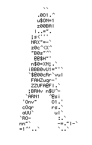

<body>
<h1>Hello guys 👋​, I'm Rafael</h1>

### 👨🏽‍💻 Sobre mim:

💻 | _Estudante de Análise e Desenvolvimento de Sistema_.

🧢 | `console.log('Apreciador de códigos.')`

📚 | Gosto de aprender e ensinar.

🗿 | A persistência é o caminho do êxito.

### 💡 Habilidades técnicas:

    &nbsp;&nbsp;&nbsp;&nbsp;&nbsp;&nbsp;&nbsp;
    
    &nbsp;&nbsp;&nbsp;
    
    &nbsp;&nbsp;&nbsp;
    
    &nbsp;&nbsp;&nbsp;
    
    &nbsp;&nbsp;&nbsp;
    
    &nbsp;&nbsp;&nbsp;
    
    &nbsp;&nbsp;&nbsp;
    
    &nbsp;&nbsp;&nbsp;

### 📱 Rede Sociais:

<a href="https://www.linkedin.com/in/rafael-henrique-soares-de-freitas-2a667a23a/" title="Linkedin | Rafael Henrique">
    &nbsp;&nbsp;&nbsp;&nbsp;&nbsp;&nbsp;&nbsp;
    
</a>

</body>
